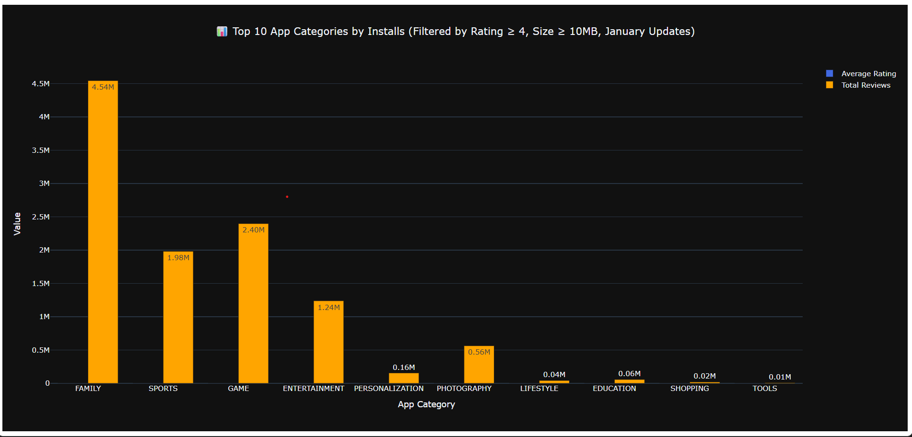

# 📊 Google Play Store Analytics – Task 1

This project is part of my **Data Analytics Internship**, focusing on **real-world data cleaning, filtering, and visualization** using the **Google Play Store dataset** from Kaggle.  
**Task 1** involves creating a **grouped bar chart** that compares the **average user rating** and **total review count** across the **Top 10 app categories** by total installs.

---

## 🧩 Objective
To analyze which app categories achieve both **high user satisfaction (ratings)** and **strong user engagement (reviews)** among the most-installed apps.

---

## 🖼️ Dashboard Preview
Here’s the output dashboard for this task 👇  

> 🖼️ *Make sure your `task_1.png` image is saved in the **same folder** as this README so it appears correctly on GitHub.*

---

## ⚙️ Data Cleaning & Preparation
- Replaced `"Varies with device"` in the `Size` column with `NaN`.  
- Converted size units (`k`, `M`) into **numeric MB values**.  
- Removed formatting characters (`+`, `,`) from `Installs`.  
- Converted `Installs`, `Reviews`, and `Rating` into numeric data types.  
- Parsed `Last Updated` into proper `datetime` objects.  
- Dropped incomplete or invalid rows to ensure clean analysis.

---

## 📈 Methodology

### 1️⃣ Filtering Criteria
- `Rating ≥ 4.0`  
- `Size ≥ 10 MB`  
- `Last Updated` in **January**

### 2️⃣ Grouping & Aggregation
- Grouped data by **Category**.  
- Calculated:  
  - **Average Rating**  
  - **Total Reviews**  
  - **Total Installs**  
- Selected **Top 10 categories** based on total installs.

### 3️⃣ Visualization
- Built a **Grouped Bar Chart** using **Plotly Express**.  
- Compared **Average Rating (Blue)** vs **Total Reviews (Orange)**.  
- Added dynamic hover labels, titles, and legends.  
- Included a **time-based condition**: the chart is visible only between **3 PM – 5 PM IST**, simulating a real-time dashboard scenario.

---

## 🛠️ Tools & Libraries
- **Python 3**  
- **Pandas** · **NumPy** · **Datetime** · **Pytz**  
- **Plotly Express** (for advanced interactive visualization)

---

## 💡 Key Insight
Top-performing app categories not only achieve **high engagement** (reviews) but also maintain **strong user satisfaction** (ratings), showing how quality drives popularity in the Play Store ecosystem.

---

## 👩‍💻 Author
**Rakshitha S**  
_Data Analytics Intern_  

📧 **Email:** srakshitha212@gmail.com  
🔗 **LinkedIn:** [linkedin.com/in/rakshitha-s-a7b694319](https://www.linkedin.com/in/rakshitha-s-a7b694319/)  
🐙 **GitHub:** [Rakshitha0103](https://github.com/Rakshitha0103)

---

*This README documents **Task 1** of the **Google Play Store Analytics Internship Project**.*
