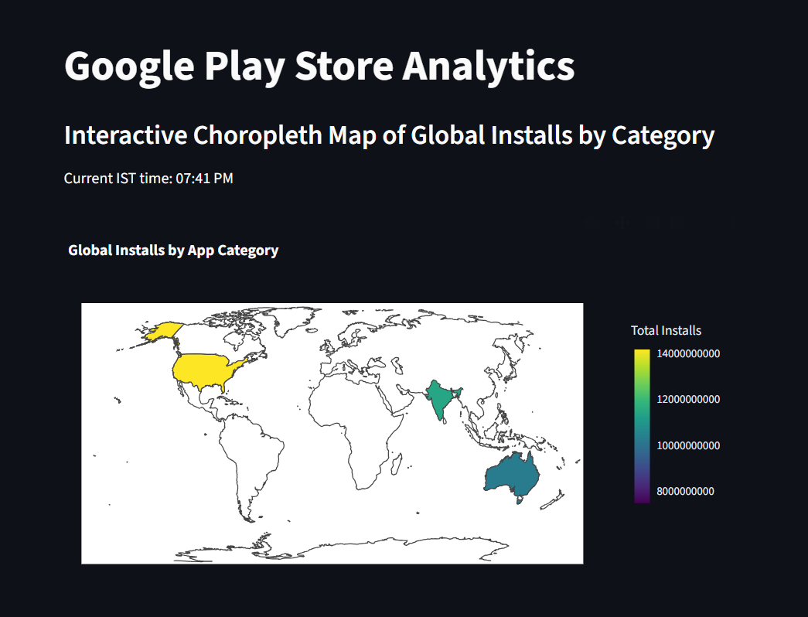

# Google Play Store Analytics – Task 2

This task is part of the Google Play Store Analytics project. 
It focuses on creating an interactive Choropleth Map using Python and Plotly to visualize global installs by app category. 
The project demonstrates advanced data filtering, conditional logic, and geographic visualization.

------------------------------------------------------------

## Objective

To analyze global installs of the most popular app categories and highlight categories with exceptionally high user engagement.

------------------------------------------------------------

## Dashboard Preview

Here is the output dashboard for this task:

!

------------------------------------------------------------

## Steps Followed

### Dataset  
- Source: Google Play Store Apps dataset from Kaggle.

### Data Preprocessing  
- Cleaned and standardized key columns such as Size, Installs, Reviews, and Last Updated.  
- Removed non-numeric symbols (+, ,) and converted sizes into MB.  
- Ensured consistent numeric types for accurate analysis.

### Filtering Rules  
- Excluded app categories starting with A, C, G, or S.  
- Selected only the Top 5 categories based on total installs.  
- Highlighted categories where total installs exceeded 1 million.

### Mapping  
- Used Plotly Express Choropleth to build an interactive world map.  
- Assigned each top category a representative country for display.  
- The color intensity represents total installs, and hover labels show category names.

### Dynamic Visibility  
- Added a time-based condition (6 PM – 8 PM IST) to control when the map appears on the dashboard, simulating a real-time data view.

------------------------------------------------------------

## Output Summary

The interactive global map includes:
- The top 5 app categories after applying all filters.
- Country-wise representation for each category.
- Highlights for categories with more than 1 million installs.
- Smooth hover interactions and an intuitive color legend.

------------------------------------------------------------

## Tools and Libraries Used

- Python 3  
- Pandas  
- NumPy  
- Datetime  
- Pytz  
- Plotly Express

------------------------------------------------------------

## Key Insight

The top-performing app categories demonstrate strong international reach and user engagement, highlighting how effective apps scale globally across markets.

------------------------------------------------------------

## Author

Rakshitha S  
Data Analytics Intern  

Email: srakshitha212@gmail.com  
LinkedIn: https://www.linkedin.com/in/rakshitha-s-a7b694319/  
GitHub: https://github.com/Rakshitha0103

------------------------------------------------------------

This README documents Task 2 of the Google Play Store Analytics Internship Project.
