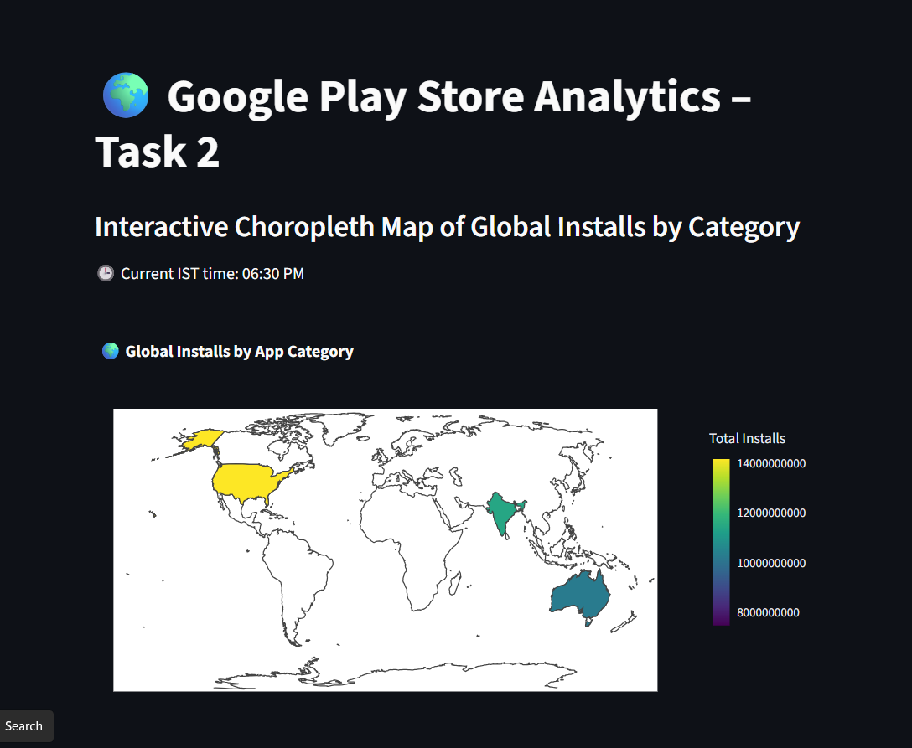

# 🌍 Google Play Store Analytics – Task 2

This task extends the **Google Play Store Analytics** project by creating an **interactive Choropleth Map** using Python and Plotly to visualize **global installs by app category**.  
It demonstrates advanced data filtering, conditional logic, and geographic storytelling through interactive visualization.

---

## 🧩 Objective
To analyze **global installs** of the most popular app categories and highlight categories with exceptionally high user engagement.

---

## 🖼️ Dashboard Preview
Here’s the output dashboard for this task 👇  

---

## ⚙️ Key Steps

### 1️⃣ Dataset  
- **Source:** Kaggle – Google Play Store Apps  

### 2️⃣ Preprocessing  
- Cleaned and standardized key columns (`Size`, `Installs`, `Reviews`, `Last Updated`).  
- Removed non-numeric symbols (`+`, `,`) and converted sizes into MB.  
- Ensured consistent numeric types for accurate analysis.  

### 3️⃣ Filtering Rules  
- Excluded app categories starting with **A**, **C**, **G**, or **S**.  
- Selected only the **Top 5 categories** by total installs.  
- Highlighted categories where total installs > **1 million (1 M)**.  

### 4️⃣ Mapping  
- Used **Plotly Express Choropleth** to build an interactive world map.  
- Assigned each top category a representative country for display.  
- Color intensity represents total installs; hover labels show category names.  

### 5️⃣ Dynamic Visibility  
- Added a **time-based condition (6 PM – 8 PM IST)** to control when the map appears on the dashboard — simulating real-time analytics.

---

## 🧮 Output Summary
A Plotly-powered **interactive global map** showing:  
- **Top 5 app categories** after filtering.  
- **Country-wise representation** of each category.  
- **Highlighting** for categories exceeding 1 million installs.  
- Smooth hover interactions and an intuitive color legend.

---

## 🛠️ Tools & Libraries
- **Python 3**  
- **Pandas**, **NumPy**, **Datetime**, **Pytz**  
- **Plotly Express** (for visualization)  

---

## 📊 Key Insight
Top-performing categories achieve broad international appeal, reinforcing how **high-engagement apps** scale effectively across diverse markets.

---

## 👩‍💻 Author
**Rakshitha S**  
_Data Analytics Intern_  

📧 **Email:** srakshitha212@gmail.com  
🔗 **LinkedIn:** [linkedin.com/in/rakshitha-s-a7b694319](https://www.linkedin.com/in/rakshitha-s-a7b694319/)  
🐙 **GitHub:** [Rakshitha0103](https://github.com/Rakshitha0103)

---

*This README documents **Task 2** of the Google Play Store Analytics Internship Project.*
