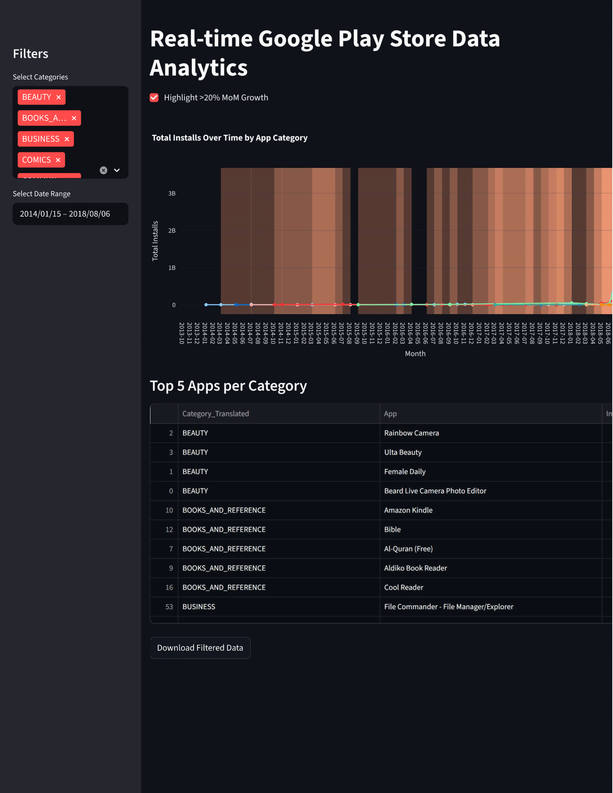

# 📊 Google Play Store Analytics – Task 4

This project is part of my **Data Analytics Internship**, focusing on **real-world data analysis, interactive visualization, and dashboard creation** using the **Google Play Store dataset** from Kaggle.  
**Task 4** involves building an **interactive Streamlit dashboard** to analyze total installs over time by app category, highlight significant growth periods, and provide filters and top app insights.

---

## 🧩 Objective
To explore **trends in app installs across categories**, identify **periods of significant growth (> 20% month-over-month)**, and highlight **top-performing apps**, while enabling users to interact with the dataset through **filters and downloads**.

---

## 🖼️ Dashboard Preview
Here’s the output dashboard for this task 👇  

---

## 🧮 Data Cleaning & Preparation
- Filtered app names **not starting with X, Y, Z** and **not containing “S”**.  
- Filtered app categories **starting with E, C, or B**.  
- Included only apps with **reviews > 500**.  
- Translated categories for better readability:  
  - **Beauty → सौंदर्य** (Hindi)  
  - **Business → வியாபாரம்** (Tamil)  
  - **Dating → Dating_DE** (German placeholder)  
- Cleaned `Installs` column by removing `+` and `,` and converting to numeric.  
- Converted `Last Updated` to datetime objects and dropped invalid rows.  
- Aggregated total installs by month and category.  
- Calculated month-over-month percentage change for growth analysis.

---

## 📈 Methodology

### 🔹 Filtering & Aggregation
- Users can filter apps by category and date range.  
- Data aggregated by month (`YearMonth`) and category.  
- Month-over-month growth percentage calculated for each category.  

### 🔹 Interactive Visualization
- Built with **Plotly** and displayed in **Streamlit**.  
- Line chart shows **total installs over time**.  
- Highlight **> 20% MoM growth periods** with shaded areas (toggle via checkbox).  
- X-axis: Month  |  Y-axis: Total Installs  |  Legend: App Categories (Translated).

### 🔹 Top Apps Table
- Displays **Top 5 apps per category** by total installs.  

### 🔹 Download Option
- Filtered data can be downloaded as **CSV** for further analysis.  

### 🔹 Time-Based Restriction
- Graph visible only **between 6 PM and 9 PM IST**, otherwise a warning message appears.

---

## 🖼️ Output Preview
- Interactive line chart with distinct colors for each category.  
- Shaded areas highlight periods with **> 20% MoM growth**.  
- “Top 5 Apps” table shows most popular apps per category.  
- Sidebar filters allow category and date range selection.  
- Download button exports filtered dataset.

---

## 🛠️ Tools & Libraries
- **Python 3**  
- **Pandas**  
- **Plotly**  
- **Streamlit**

---

## 📊 Key Insights
- Categories with **high total installs** often show **strong growth spikes**, reflecting emerging app trends.  
- Interactive filters help uncover **top apps** within specific time frames.  
- Multilingual category translation improves readability and global accessibility.  
- The dashboard demonstrates how **real-time analytics** enhances interactive data exploration.

---

## 👩‍💻 Author
**Rakshitha S**  
_Data Analytics Intern_  

📧 **Email:** srakshitha212@gmail.com  
🔗 **LinkedIn:** [linkedin.com/in/rakshitha-s-a7b694319](https://www.linkedin.com/in/rakshitha-s-a7b694319/)  
🐙 **GitHub:** [Rakshitha0103](https://github.com/Rakshitha0103)

---

*This README documents **Task 4** of the Google Play Store Analytics Internship Project.*
